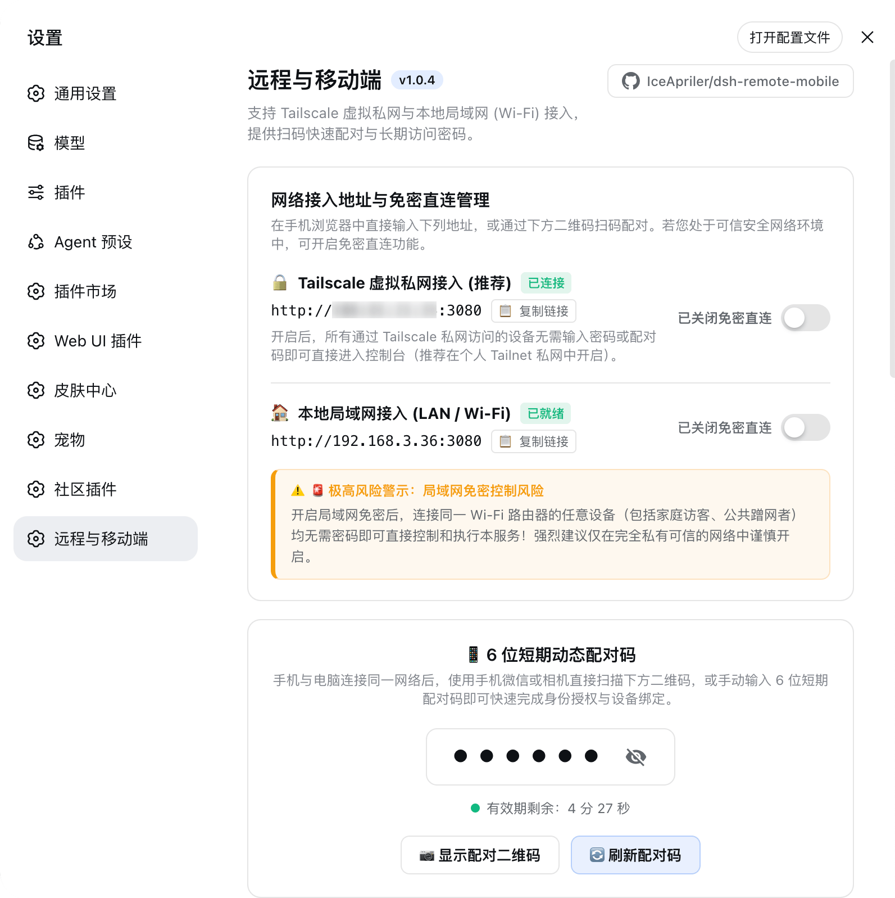
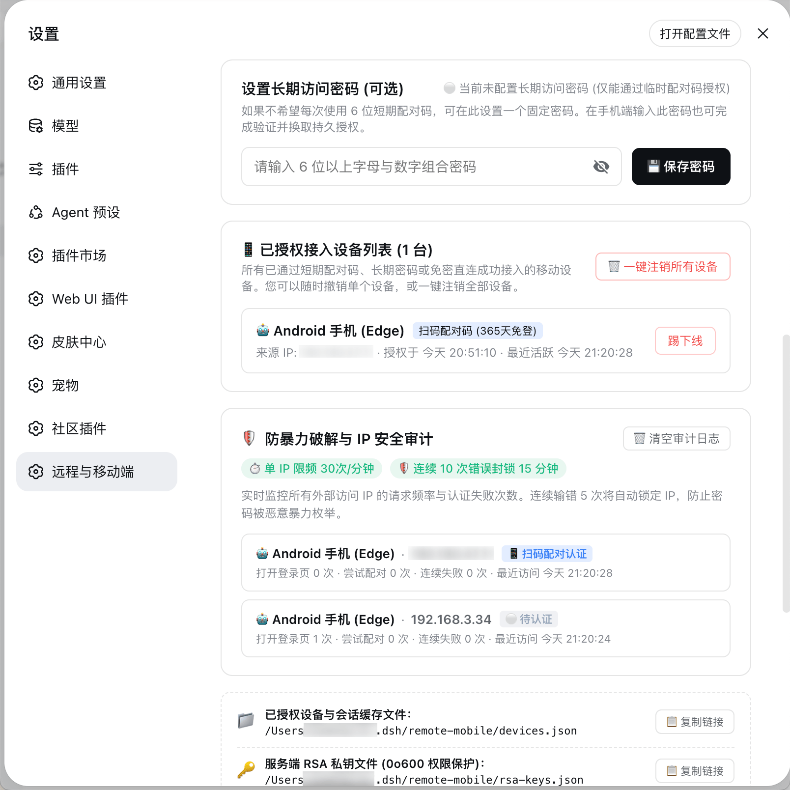
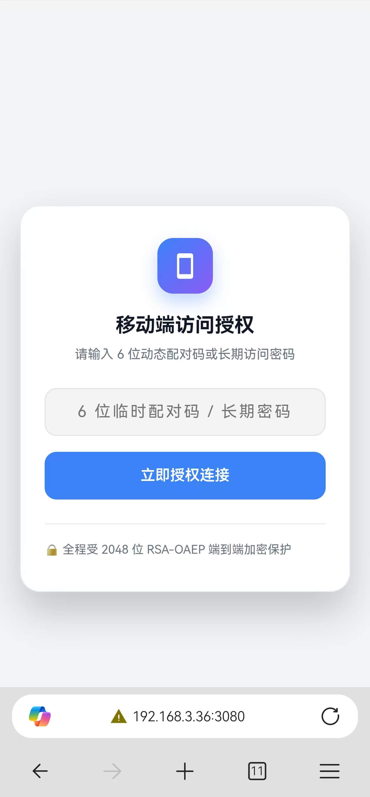
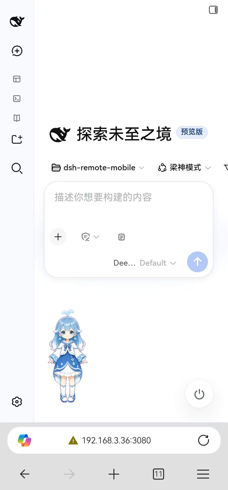

<div align="center">

# dsh-remote-mobile

**DeepSeek Hub (DSH) 远程移动端与局域网安全接入插件**

[](https://www.npmjs.com/package/dsh-remote-mobile)
[](https://github.com/IceApriler/dsh-remote-mobile/blob/master/LICENSE)
[](https://nodejs.org)
[](https://github.com/deepseek-ai)

<p align="center">
  <b>突破本地限制 · 扫码直连 · 工作区全功能无缝复用 · 端到端安全门禁</b>
</p>

[English Documentation](./README_EN.md) · [简体中文](./README.md)

<p align="center">
  <a href="#about">这是什么</a> •
  <a href="#advantages">核心优势</a> •
  <a href="#quick-start">快速开始</a> •
  <a href="#config">必备配置</a> •
  <a href="#preview">界面预览</a> •
  <a href="#features">功能特性</a> •
  <a href="#install">安装方式</a> •
  <a href="#faq">常见问题</a>
</p>

---

</div>

<span id="about"></span>
## 📖 这是什么

`dsh-remote-mobile` 是专为 **DeepSeek Hub (DSH)** 深度定制的远程与移动端安全治理插件。

DSH 核心服务出于安全考虑默认仅监听本地回环地址（`127.0.0.1`），使得手机、平板或其他电脑无法从外部直接访问 Web 控制台。本项目通过**全局安全门禁中间件**与**请求上下文隔离虚拟化技术**，安全地开放了 **Tailscale 虚拟私网** 以及 **本地局域网 (Wi-Fi/LAN)** 访问能力，并提供企业级传输加密、扫码配对、长期密码认证与防暴力破解审计体系。

---

<span id="advantages"></span>
## ⚡ 核心优势

* 🚀 **突破网络壁垒，工作区全功能无缝复用**：彻底解决局域网和 Tailscale 无法访问 DSH Web 的问题。在移动端或外部设备访问时，**完美支持新建工作区、切换工作区、执行终端命令等全部桌面端核心能力**，无任何功能阉割！
* 📱 **手机端与 Web 绝对同源一体（零额外维护成本）**：手机端直接复用 DSH Web 官方同源底座与完整生态插件（如 `dsh-pet` 宠物、任务看板等），后端与服务逻辑 100% 保持一致，后期只需按需适配移动端响应式样式即可，无需单独维护手机端后台！
* 🛡️ **端到端安全门禁与传输加密**：内置 RSA 非对称公钥加密、`scrypt` 加盐慢哈希密码落盘、连续输错自动熔断锁定 IP，杜绝公网/局域网未经授权的非法刺探。
* 📲 **开箱即用极速配对**：自动识别并生成 Tailscale CGNAT 与局域网专属访问链接与二维码，手机扫码 5 秒内即可完成长效授权换票。
* 🔄 **SSE 实时状态全双工推送**：设备上线、下线、踢出、IP 锁定等安全事件毫秒级推送，无需前端低效轮询。

---

<span id="quick-start"></span>
## 🚀 快速开始

### 1. 一键安装插件

在终端执行 DSH 官方插件安装指令（推荐）：

```bash
dsh plugin --profile web add dsh-remote-mobile
```

---

<span id="config"></span>
### 2. 必备前置配置（开放外部监听）

由于 DSH 默认仅监听 `127.0.0.1`，为了使 Tailscale 私网或局域网设备能够正常连通，请确保在 `~/.dsh/profiles/web/cordis.patch.yml` 中包含以下配置：

```yaml
# 1. 允许 webserver 监听外部网络连接（必选）
- id: webserver
  name: '@deepseek-ai/dsh-host-webserver'
  inject: [webStartup]
  config:
    host: '0.0.0.0'
    port: 3080

# 2. 禁用 @linxin666/dsh-web-ui-all 内置的旧版远程插件（必选：防止路由冲突与界面覆盖）
- id: web-ui-remote-web-ui
  disabled: true
```

> **💡 说明**：插件自身注册已由 DSH Bundle 体系全自动处理，**无需**在 `cordis.patch.yml` 中额外添加 `id: remote-mobile`。

---

### 3. 启动并使用

```bash
dsh web --no-open
```

启动后，在电脑浏览器打开 DSH Web 控制台，进入 **设置 ⚙️ -> 远程与移动端**，使用手机微信或系统相机扫描二维码即可立即开启移动端接入！

---

<span id="preview"></span>
## 🖼️ 界面预览

### PC 端 DSH 插件控制面板

| 网络接入与扫码配对 | 长期密码、设备会话与 IP 防暴破审计 |
| :---: | :---: |
|  |  |

---

### 手机端实机演示（同源免登与工作区全功能）

| 手机扫码授权登录页 | 手机端完整控制 DSH 工作区与操作 |
| :---: | :---: |
|  |  |

---

<span id="features"></span>
## 🌟 功能特性

### 1. 网络接入支持
- **Tailscale 虚拟私网**：自动识别本机 Tailscale IP（`100.64.0.0/10` CGNAT 网段），生成专属访问二维码，支持开启免密直连（底层传输加密由 Tailscale WireGuard 隧道保障）。
- **本地局域网 (LAN / Wi-Fi)**：自动识别 RFC 1918 私有 IP（如 `192.168.x.x`、`10.x.x.x`、`172.16-31.x.x`），提供局域网专属二维码与直达链接预览，并配备高危醒目风险提示。
- **二维码快速配对**：支持手机相机或微信扫码直达授权页面。

### 2. 多重认证机制
- **动态 6 位配对码**：生成 6 位短期配对码（5 分钟有效，一次性使用），手机端扫码输入后换取 365 天有效期的安全认证 Cookie。
- **长期访问密码**：支持设置自定义长期访问密码（长度需至少 6 位且含字母与数字），便于多设备长期固定登录。
- **免密直连模式**：可针对 Tailscale 或局域网环境单独切换免密直连。关闭免密直连后会自动清理临时设备凭证并重置状态。
- **设备会话管理**：实时查看已连接设备的类型、操作系统、浏览器、来源 IP 及最近活跃时间，支持单设备注销与一键注销全部设备。

### 3. 企业级安全防护
- **传输层 RSA 非对称加密**：登录认证接口支持客户端 RSA 加密（RSA-OAEP-SHA256 与 PKCS#1 v1.5 兼容），敏感密码与配对码在客户端加密后再通过网络传输。
- **scrypt 慢哈希存储**：服务端采用 `scrypt` 加盐慢哈希算法（`scrypt:${salt}:${hash}`）对密码进行落盘存储，比对过程采用 `crypto.timingSafeEqual` 恒定时间算法以防范时序侧信道攻击。
- **防暴力破解与限频保护**：
  - 连续输错凭证达到阈值（默认 5 次）自动锁定该 IP 15 分钟，拦截后续验证请求并返回 HTTP 429；
  - 滑动窗口限频（默认 60 次/分钟），防范恶意刷量；
  - 访问审计与锁定状态持久化落盘，服务重启后自动恢复；
  - 支持管理员在管理面板中一键解锁指定 IP。
- **真实 IP 安全提取**：仅信任底层 Socket 真实连接地址，防范伪造的 `X-Forwarded-For` 欺骗攻击。

### 4. 实时状态同步与国际化
- **SSE 事件全双工通道**：基于 Server-Sent Events 实现新设备接入、设备重连、会话撤销及安全告警的实时双向通知。
- **全界面中英文双语自适应**：根据 DSH 全局语言偏好与浏览器环境，动态自适应中英文面板、提示及手机端界面。
- **非 HTTPS 兼容补丁**：自动注入 `crypto.randomUUID` Polyfill，解决移动端浏览器在 HTTP 非安全上下文下缺少原生 API 的报错。

---

<span id="install"></span>
## 📦 全部安装方式

<details>
<summary><b>展开查看全部 4 种安装方式</b></summary>

### 方式 1：通过 DSH 命令行一键安装（最推荐）
```bash
dsh plugin --profile web add dsh-remote-mobile
```

### 方式 2：通过 Web 设置页「插件管理」图形化安装
1. 在浏览器打开 DSH Web 控制台；
2. 点击左下角 **设置 ⚙️ -> 插件**；
3. 切换到顶部的 **「插件管理」** Tab；
4. 在输入框中输入 npm 包名 **`dsh-remote-mobile`**，点击 **「安装」**；
5. 安装完成后重启 DSH 即可生效。

### 方式 3：在 Profile 目录中通过包管理器安装
```bash
# 1. 进入 DSH Web Profile 目录
cd ~/.dsh/profiles/web

# 2. 通过 pnpm 安装
pnpm add dsh-remote-mobile
```

### 方式 4：本地源码开发与调试（软链接即时生效）
```bash
# 1. 克隆代码至本地
git clone https://github.com/IceApriler/dsh-remote-mobile.git
cd dsh-remote-mobile

# 2. 安装依赖并编译打包
npm install
npm run build

# 3. 建立软链接到 DSH 运行环境（开发修改后 npm run build 即时生效）
rm -rf ~/.dsh/profiles/web/node_modules/dsh-remote-mobile
ln -s $(pwd) ~/.dsh/profiles/web/node_modules/dsh-remote-mobile
```

</details>

---

## ⚙️ 高级配置

插件已完全接入 DSH 官方 Settings 体系，配置项支持在 Web 界面中直观调整，也可在 `~/.dsh/settings.yaml` 的 `dsh-remote-mobile` 命名空间下手动修改：

```yaml
dsh-remote-mobile:
  allowTailscale: false       # boolean，默认 false：是否允许 Tailscale 虚拟私网免密访问
  allowLan: false             # boolean，默认 false：是否允许局域网免密访问（高危警示）
  secretHash: ""              # string，默认空：长期访问密码的 scrypt 加盐哈希值
  maxVisitsPerMinute: 60      # number，默认 60：单 IP 每分钟最大访问登录页次数
  maxFailedAttempts: 5        # number，默认 5：触发封禁的连续认证失败最大次数
  lockDurationMs: 900000      # number，默认 900000 (15分钟)：IP 锁定持续时间（毫秒）
```

---

## 📂 本地文件存储位置

| 文件路径 | 说明 | 安全级别 |
|---|---|---|
| `~/.dsh/settings.yaml` | 全局安全策略与免密开关配置 | 用户级读写 |
| `~/.dsh/remote-mobile/devices.json` | 已授权设备会话、IP 访问计数与安全审计数据 | 本地落盘持久化 |
| `~/.dsh/remote-mobile/rsa_private.key` | 服务端 RSA 私钥文件 | 系统级权限 `0o600`（仅当前用户可读写） |

---

<span id="faq"></span>
## ❓ 常见问题 (FAQ)

<details>
<summary><b>Q1: 手机扫码后提示「连接被拒绝」或无法打开页面？</b></summary>

**答**：请检查以下三项：
1. 确保电脑上的 `cordis.patch.yml` 中已配置 `host: '0.0.0.0'`，且 DSH 已经重启；
2. 局域网访问时，确保手机与电脑连接在同一个 Wi-Fi / 路由器下；
3. 如果开启了电脑操作系统自带的防火墙，请确保允许入站访问 `3080` 端口。
</details>

<details>
<summary><b>Q2: Tailscale 免密直连和局域网免密有什么区别？</b></summary>

**答**：
* **Tailscale 免密**：高度安全。因为 Tailscale 是基于 WireGuard 的端到端加密虚拟私网，只有你自己登录了同一账号的设备才能连通。
* **局域网免密**：存在安全隐患。任何连入你家 Wi-Fi 的设备（包括访客或蹭网设备）均可直接控制你的工作区，因此非完全可信环境**切勿开启**。
</details>

<details>
<summary><b>Q3: 手机端切换或新建工作区能正常使用吗？</b></summary>

**答**：**完全支持！** 本插件通过虚拟化技术打通了上下文隔离，手机端与 PC 桌面端拥有 100% 一致的工作区管理与执行能力。
</details>

---

## 📄 开源许可证

本项目采用 [MIT License](LICENSE) 协议开源。
