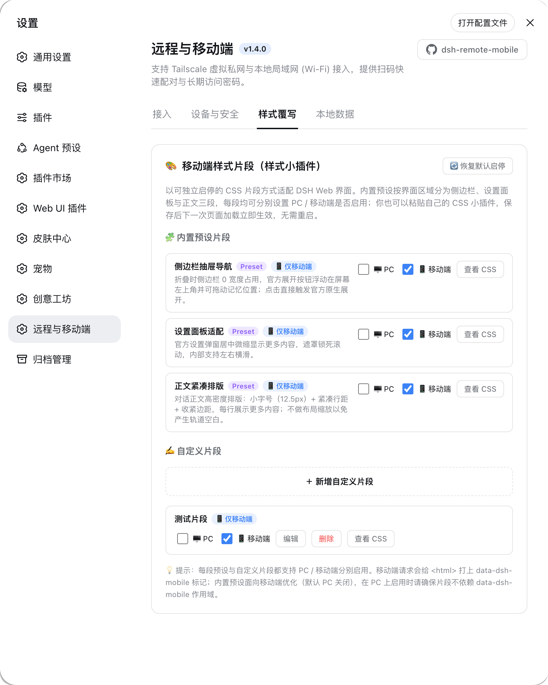
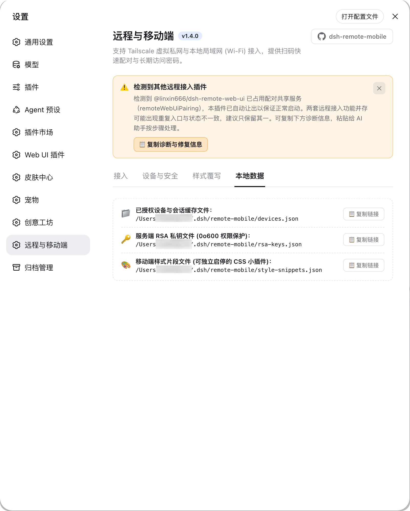
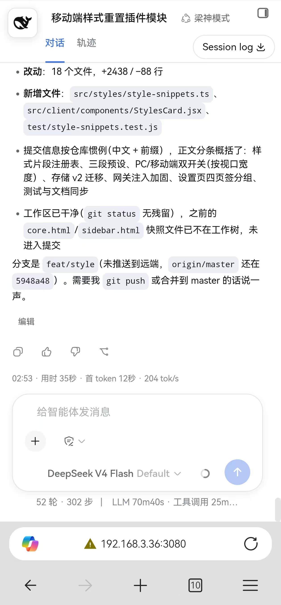
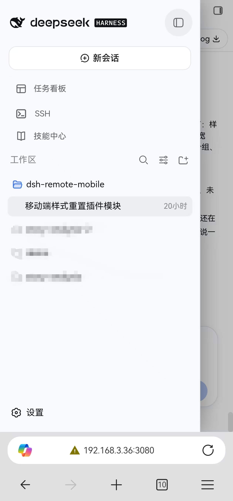
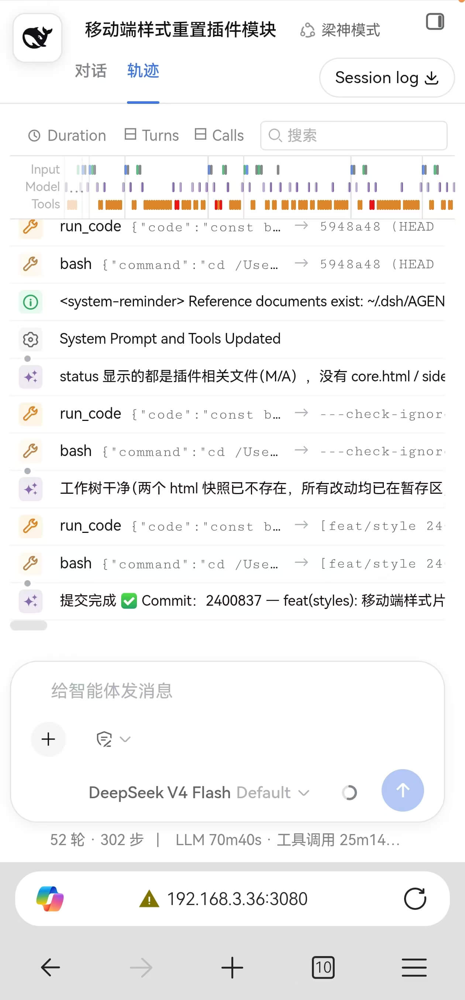

<div align="center">

# dsh-remote-mobile

**DeepSeek Harness (DSH) Remote & Mobile Security Guard Plugin**

[](https://www.npmjs.com/package/dsh-remote-mobile)
[](https://www.npmjs.com/package/dsh-remote-mobile)
[](https://nodejs.org)
[](https://github.com/IceApriler/dsh-remote-mobile/blob/master/LICENSE)

<p align="center">
  <b>Zero Core Modifications · Break Loopback Limits · QR Quick Pairing · Full Workspace Parity · Transport Encryption</b>
</p>

English Documentation · [简体中文](./README.md)

<p align="center">
  <a href="#about">About</a> •
  <a href="#advantages">Key Advantages</a> •
  <a href="#quick-start">Quick Start</a> •
  <a href="#config">Required Config</a> •
  <a href="#preview">UI Preview</a> •
  <a href="#features">Features</a> •
  <a href="#install">Installation & Update</a> •
  <a href="#faq">FAQ</a>
</p>

---

</div>

<span id="about"></span>
## 📖 About

`dsh-remote-mobile` is a dedicated remote and mobile security governance plugin designed specifically for **DeepSeek Harness (DSH)**.

By default, DSH strictly listens only to the local loopback address (`127.0.0.1`), preventing mobile devices, tablets, or external computers from accessing the Web console. This plugin uses **access control middleware** and **request isolation** to securely open up **Tailscale Private Network** and **Local Area Network (LAN / Wi-Fi)** access, complete with RSA transmission encryption, QR code pairing, persistent password auth, and automated brute-force defense.

When accessed from a phone, the plugin also adapts the DSH interface for **mobile styles**: a collapsible sidebar drawer with a draggable floating toggle, a centered/scaled settings dialog, and dense conversation typography — so the mobile experience feels closer to the desktop.

---

<span id="advantages"></span>
## ⚡ Key Advantages

* 🚀 **Break Network Barriers with Full Workspace Parity**: Solves the core issue of accessing DSH Web over LAN and Tailscale. When accessed on mobile devices, **creating workspaces, switching workspaces, and executing terminal commands are supported** without feature degradation.
* 📱 **Dedicated Mobile Adaptations & Same-Origin Reuse**: Directly reuses the official DSH Web base and complete plugin ecosystem (such as `dsh-pet`, task boards, etc.) without maintaining a separate mobile backend. Includes out-of-the-box mobile adaptations (sidebar drawer toggle, centered settings modal, and compact chat font scaling for higher information density), alongside a built-in **Style Snippet Override system** to toggle presets or inject custom CSS snippets on demand.
* 🛡️ **Security Gateway & Transport Encryption**: Built-in client-side RSA asymmetric public key encryption, `scrypt` salted slow-hashing password persistence, and automated IP lockout upon consecutive brute-force failures, blocking unauthorized access over public/LAN networks.
* 📲 **Quick QR Pairing**: Auto-detects Tailscale CGNAT and LAN IP addresses to generate dedicated pairing QR codes. Scan the code to authenticate and obtain persistent credentials.
* 🔄 **SSE Real-Time Push**: Device connection, reconnection, revocation, and security alert events are pushed in real time via Server-Sent Events without polling.
* 🤝 **Generic Plugin Coexistence Protection**: Starts safely alongside other remote/Web access plugins by automatically yielding the shared service; the settings panel shows a conflict banner with a one-click copyable diagnosis & fix report.

---

<span id="quick-start"></span>
## 🚀 Quick Start

### 1. One-Command Installation

Run the DSH official plugin management command in your terminal (Recommended):

```bash
dsh plugin --profile web add dsh-remote-mobile
```

> [!IMPORTANT]
> **Ecosystem Plugin Advice**: **Installing `@linxin666/dsh-web-all` (all-in-one package) is not recommended**. We suggest **installing individual standalone plugins on demand**. The all-in-one package bundles multiple frontend modules together, which may result in duplicated mobile floating buttons and conflicting gesture handlers. If you need task boards, pet widgets, or other tools, install their standalone packages directly (see details below).

---

<span id="config"></span>
### 2. Configuration (Open External Listening)

Because DSH defaults to `127.0.0.1`, ensure your `~/.dsh/profiles/web/cordis.patch.yml` (on Windows: `C:\Users\<username>\.dsh\profiles\web\cordis.patch.yml` or enter `%USERPROFILE%\.dsh` in File Explorer) includes the following configuration to allow external connectivity:

```yaml
# 1. Allow webserver to listen for external connections (Required)
- id: webserver
  name: '@deepseek-ai/dsh-host-webserver'
  inject: [webStartup]
  config:
    host: '0.0.0.0'
    port: 3080

# 2. (Recommended) Keep only ONE remote/Web access plugin to avoid duplicated entries.
#    This plugin starts normally alongside other remote-access plugins: when it
#    detects the shared pairing service is already taken by another plugin, it
#    yields automatically and shows a warning banner at the top of its settings panel.
#    Example: disable the legacy remote plugin bundled in @linxin666/dsh-web-ui-all
- id: web-ui-remote-web-ui
  disabled: true
```

> **💡 Note**: Plugin self-registration is automatically handled by the DSH Bundle system. You do **not** need to add `id: remote-mobile` manually. Windows users can press `Win + R` and enter `%USERPROFILE%\.dsh\profiles\web` to quickly jump to the configuration folder.

> [!WARNING]
> **⚠️ Plugin Compatibility & Coexistence Note: Prefer installing standalone plugins over the all-in-one bundle (`@linxin666/dsh-web-all`)**
> 
> * **Why do we recommend avoiding `@linxin666/dsh-web-all`?**
>   1. **Avoid duplicated entries and gesture conflicts**: The all-in-one package compiles the frontend logic of multiple plugins into a single `client.js`. Its mobile adaptation logic executes upon script load. Even if you set `web-ui-remote-web-ui: disabled: true` in `cordis.patch.yml`, the browser may still render the floating whale button (`#dshRemoteWhale`), leading to duplicated mobile entry points and conflicting touch gestures.
>   2. **Lightweight and independently upgradable**: Installing standalone packages keeps the environment minimal and lets you upgrade, rollback, or configure each component independently.
> 
> * **Recommended Best Practice (Install Standalone Plugins)**:
>   Install only the specific standalone packages you actually need, for example:
>   ```bash
>   # Recommended: clear responsibilities, decoupled, fully controllable
>   dsh plugin --profile web add @linxin666/dsh-client-ui-task-board
>   dsh plugin --profile web add @linxin666/dsh-client-ui-web-ui-settings
>   dsh plugin --profile web add @linxin666/dsh-pet
>   dsh plugin --profile web add @linxin666/dsh-ssh
>   ```
>   *(Note: Starting from v1.6.0, `dsh-remote-mobile` includes automated compatibility handling that prepends `dsh-remote-force-desktop` to sessionStorage and coordinates with CSS to prevent the `#dshRemoteWhale` button from mounting twice. For the cleanest setup, installing standalone packages remains the best practice)*.

---

### 3. Launch & Pair

```bash
dsh web --no-open
```

Open the DSH Web Console in your browser, navigate to **Settings ⚙️ -> Remote & Mobile Access**, and scan the QR code with your mobile camera or WeChat to start using DSH on mobile!

---

<span id="preview"></span>
## 🖼️ UI Preview

### Desktop DSH Plugin Control Panel

| Network Access & QR Pairing | Devices & Security |
| :---: | :---: |
|  |  |
| **Style Snippets Override** | **Local Data Storage** |
|  |  |

---

### Mobile Live Demonstration (Same-Origin Auth & Full Workspace Control)

| Login & Auth | Chat Font Scaling | Mobile Sidebar Styling | Official Trajectory / Trace |
| :---: | :---: | :---: | :---: |
|  |  |  |  |

---

<span id="features"></span>
## 🌟 Features

### 1. Network Access
- **Tailscale Private Network**: Automatically detects local Tailscale IP (`100.64.0.0/10` CGNAT subnet), creates pairing QR codes, and supports direct passwordless bypass (transport encryption guaranteed by Tailscale WireGuard tunnels).
- **Local Area Network (LAN / Wi-Fi)**: Automatically detects RFC 1918 private IPs (`192.168.x.x`, `10.x.x.x`, `172.16-31.x.x`), generates LAN pairing QR codes with direct link previews and prominent high-risk security warnings.
- **Instant QR Pairing**: Scan QR codes directly with any mobile camera or scanner app to authenticate.

### 2. Multi-Tier Authentication
- **Dynamic 6-Digit Pairing Codes**: Generates 6-digit short codes (5-minute validity, single-use) that exchange for 365-day persistent authentication cookies on mobile.
- **Persistent Access Passwords**: Set customizable persistent passwords (minimum 6 characters with letters and numbers) for seamless long-term logins across multiple devices.
- **Direct Bypass Mode**: Enable passwordless direct bypass independently for Tailscale or LAN. Disabling bypass immediately cleans up temporary credentials and resets device state.
- **Device Session Management**: Real-time inspection of connected device types, OS, browser, source IP, and last active timestamp, with single-device revocation and one-click bulk revocation.

### 3. Security & Cryptography
- **Transport RSA Asymmetric Encryption**: Login endpoints support client-side RSA encryption. In secure contexts (HTTPS) this prioritizes native Web Crypto `RSA-OAEP-SHA256`; in DSH's default HTTP LAN/Tailscale access (non-secure context) it falls back to a pure JS shim using `crypto.getRandomValues()` for cryptographically secure random padding. Sensitive passwords and pairing codes are encrypted on the client before network transmission.
- **scrypt Slow Hash Storage**: Server persists passwords with `scrypt` salted slow-hashing (`scrypt:${salt}:${hash}`). Verification uses `crypto.timingSafeEqual` constant-time comparison to prevent timing side-channel attacks.
- **Brute-Force Defense & Rate Limiting**:
  - Automatically locks out IPs for 15 minutes after reaching consecutive failed attempt thresholds (default: 5), returning HTTP 429;
  - Sliding-window rate limiting (default: 60 visits/min) to prevent high-frequency brute-force scraping;
  - Audit logs and lockout states persist to disk and restore across restarts;
  - Administrators can manually unlock blocked IPs with one click in the panel.
- **Intelligent Static Asset Whitelisting**: The authentication gate automatically allows verified frontend asset extensions (`.js`, `.css`, `.png`, `.svg`, `.woff2`, etc., 20+ types) while strictly blocking extensionless or dynamic API routes (e.g. `/plugins/xxx/admin`), ensuring smooth third-party plugin rendering without manual whitelist configuration.
- **Resilient Atomic Persistence & Debounce**: Millisecond-level debounce write-throttling to safeguard disk I/O (500ms for session data, 300ms for style snippets), coupled with `beforeExit` process flush hooks and atomic temporary file replacement (`renameSync`) for `settings.yaml` and `style-snippets.json`.
- **Real Socket IP Extraction**: Relies strictly on underlying Socket connection addresses, preventing spoofed `X-Forwarded-For` header attacks.
- **Loopback CSRF Defense**: Mutating plugin APIs validate browser same-origin signals (`Origin` / `Sec-Fetch-Site`). Cross-site write requests to `127.0.0.1` driven by malicious webpages are rejected outright; non-browser clients (curl / local scripts) are unaffected.
- **No Context Laundering for Loopback**: Context virtualization applies only to external traffic. Loopback requests keep their original Host / Origin, so the built-in DNS-rebinding and same-origin checks of DSH keep working against external domains. The SSE event stream accepts same-origin connections only, with no cross-origin reads.

### 4. Real-Time Sync & Internationalization
- **SSE Real-Time Push**: Push notifications for new device pairing, reconnections, revocations, and security alerts via Server-Sent Events, with bidirectional close listeners and idempotent cleanup.
- **Adaptive Bilingual UI**: Automatically switches between English and Simplified Chinese based on DSH settings and browser language preferences.
- **Non-HTTPS Compatibility Patch**: Injects `crypto.randomUUID` and `navigator.clipboard` Polyfills into HTML templates to fix missing native Web Crypto / Clipboard APIs in HTTP non-secure mobile browser contexts (the clipboard polyfill keeps copy and snippet-copy working in non-secure contexts).

### 5. Mobile Style Snippets (style mini-plugins)

The DSH web UI still carries many desktop-oriented styles on phones. This plugin ships a built-in **Mobile Style Snippets** module that splits mobile adaptation into toggleable CSS snippets:

- **Three area-based built-in presets**: `preset-sidebar` (collapsed sidebar becomes a 0-width drawer with draggable floating toggle, adaptive width, and touch-friendly 44px tap targets), `preset-settings` (vertically stacked layout with horizontally scrollable nav tabs and natural vertical scrolling), `preset-main` (dense conversation typography with scrollable code blocks). Mobile on / PC off by default;
- **Separate PC / Mobile toggles (viewport-width based, device-independent)**: every preset and custom snippet has independent PC and Mobile switches; "Mobile" = applies at narrow viewports (≤900px) — **a PC browser with a narrow window gets it too**; "PC" = applies at wide viewports (>900px); both on = applies at all widths;
- **Custom snippets (your own mini-plugins)**: paste your CSS in **Settings ⚙️ → Remote & Mobile → 🎨 Mobile Style Snippets** to add a snippet, with edit/toggle/delete/**one-click copy** support (every snippet has a "📋 Copy CSS" button next to "View CSS"). Persisted to `~/.dsh/remote-mobile/style-snippets.json`; changes apply on the next page load without restart;
- **UA-based marker + width-based styling**: styles apply by viewport-width band (see above), independent of device UA; mobile UA requests additionally add `data-dsh-mobile="1"` to `<html>` as a scope hook, and the draggable toggle script is injected for all clients (it only activates while the sidebar is collapsed).

### 6. Generic Plugin Coexistence Protection

- **Conflict-free startup**: when the shared pairing service `remoteWebUiPairing` is already registered by another remote/Web access plugin, this plugin yields automatically (deferred arbitration: it waits until the activation window settles, then checks who owns the service name), completely avoiding the fatal whole-tree rollback caused by service-name collisions — installing from the plugin market works out of the box with zero manual configuration;
- **Visible coexistence status**: when a conflict is detected, a dismissible warning banner (Chinese/English) appears at the top of the settings panel, explaining the yield behavior and the "keep only one" recommendation; refresh after resolving and it disappears;
- **One-click diagnosis report**: the **"📋 Copy diagnosis & fix"** button in the banner copies a full report — the conflicting plugin's package name and loader entry id are auto-detected at runtime, and the report includes line-exact fix configuration and commands (disable the other / remove this one), ready to paste to an AI assistant.

---

<span id="install"></span>
## 📦 Installation & Update

<details>
<summary><b>Expand to view all 4 installation methods</b></summary>

### Method 1: DSH CLI One-Command Install (Recommended)
```bash
dsh plugin --profile web add dsh-remote-mobile
```

### Method 2: Web GUI Plugin Marketplace Install
1. Open DSH Web console in your browser;
2. Navigate to **Settings ⚙️ -> Plugins**;
3. Switch to the **Plugin Management** tab at the top;
4. Enter the npm package name **`dsh-remote-mobile`** and click **Install**;
5. Restart DSH after installation completes.

### Method 3: Install via Package Manager in Profile Directory
```bash
# 1. Navigate to DSH Web Profile directory
cd ~/.dsh/profiles/web

# 2. Install using pnpm
pnpm add dsh-remote-mobile
```

### Method 4: Local Source Development (Instant Symlink Sync)

```bash
# 1. Clone source code
git clone https://github.com/IceApriler/dsh-remote-mobile.git
cd dsh-remote-mobile

# 2. Install dependencies & build
npm install
npm run build
```

**Create symlink to DSH runtime (changes take effect instantly on `npm run build`):**

* **macOS / Linux**:
  ```bash
  rm -rf ~/.dsh/profiles/web/node_modules/dsh-remote-mobile
  ln -s $(pwd) ~/.dsh/profiles/web/node_modules/dsh-remote-mobile
  ```

* **Windows (PowerShell)**:
  ```powershell
  Remove-Item -Recurse -Force "$HOME\.dsh\profiles\web\node_modules\dsh-remote-mobile"
  New-Item -ItemType Junction -Path "$HOME\.dsh\profiles\web\node_modules\dsh-remote-mobile" -Target (Get-Location)
  ```

* **Windows (CMD)**:
  ```cmd
  rmdir /s /q %USERPROFILE%\.dsh\profiles\web\node_modules\dsh-remote-mobile
  mklink /J %USERPROFILE%\.dsh\profiles\web\node_modules\dsh-remote-mobile %CD%
  ```

</details>

### 🔄 Updating Plugin

Run the update command in your terminal and restart DSH:

```bash
# Method 1: DSH CLI One-Command Update (Recommended)
dsh plugin --profile web update dsh-remote-mobile

# Method 2: Update via Package Manager in Profile Directory
cd ~/.dsh/profiles/web && pnpm update dsh-remote-mobile
```

> **💡 Tip**: You can also click the update button in the Web console under **Settings ⚙️ -> Plugins -> Plugin Management**, or run `dsh plugin --profile web add dsh-remote-mobile@latest`.

### 🗑️ Uninstalling

```bash
dsh plugin --profile web remove dsh-remote-mobile
```

---

## ⚙️ Advanced Configuration

Fully integrated with the DSH official Settings system. Configurations can be adjusted in the Web UI or edited in `~/.dsh/settings.yaml` under the `dsh-remote-mobile` namespace:

```yaml
dsh-remote-mobile:
  allowTailscale: false       # boolean, default false: allow passwordless access via Tailscale
  allowLan: false             # boolean, default false: allow passwordless access via LAN (High Risk)
  secretHash: ""              # string, default empty: scrypt salted hash of the persistent password
  maxVisitsPerMinute: 60      # number, default 60: max login page visits per minute per IP
  maxFailedAttempts: 5        # number, default 5: max consecutive failed attempts before IP lockout
  lockDurationMs: 900000      # number, default 900000 (15 mins): IP lockout duration in ms
```

### 🎨 Mobile Style Snippets (optional)

Custom snippets (style mini-plugins) and their enabled states are persisted in `~/.dsh/remote-mobile/style-snippets.json`. Manage them from the settings panel or edit the file directly:

```json
{
  "version": 2,
  "presetStates": {
    "preset-sidebar": { "pc": false, "mobile": true },
    "preset-settings": { "pc": false, "mobile": true },
    "preset-main": { "pc": true, "mobile": true }
  },
  "custom": [
    {
      "id": "custom-xxx",
      "name": "My style mini-plugin",
      "css": "html[data-dsh-mobile] .my-selector { ... }",
      "pcEnabled": false,
      "mobileEnabled": true
    }
  ],
  "customOrder": ["custom-xxx"]
}
```

> Enabled snippets are merged into a single `<style>` injected into the main page and the `/auth` login page; **effectiveness is decided by viewport width**: snippets with `mobileEnabled` are wrapped in `@media (max-width: 900px)` (apply at ≤900px — a narrow PC window gets them too), `pcEnabled` in `@media (min-width: 901px)`, and both on means all widths (v1 files migrate automatically; `presetStates` always persists all three preset groups with current effective values). Note: enabling the Sidebar Drawer preset on PC changes the desktop layout — turn its PC switch off if undesired.

---

## 📂 Local File Storage Locations

> **💡 Path Note**: On macOS / Linux, the base path is `~/.dsh/`; on Windows, it resolves to `C:\Users\<username>\.dsh\` (you can directly paste `%USERPROFILE%\.dsh` into the File Explorer address bar).

| Path | Description | Security Level |
|---|---|---|
| `~/.dsh/settings.yaml` | Global security policies & bypass toggles | User R/W |
| `~/.dsh/remote-mobile/devices.json` | Authorized devices, sessions & IP audit statistics (contains long-lived tokens, `0o600`) | Local storage, restricted to current user |
| `~/.dsh/remote-mobile/rsa-keys.json` | Server RSA keypair (public & private) | Local storage, `0o600` (Restricted to current user) |
| `~/.dsh/remote-mobile/style-snippets.json` | Mobile style snippets (built-in toggles + custom CSS mini-plugins) | Local persistent storage |

---

<span id="faq"></span>
## ❓ FAQ

<details>
<summary><b>Q0: Startup fails with <code>listen EADDRINUSE: address already in use 0.0.0.0:3080</code>?</b></summary>

**Answer**: This means **port 3080 is held by another process** (in most cases a previous `dsh web` instance has not fully exited — e.g. a hidden instance launched by a desktop shortcut, or overlapping old/new processes during restart). It is **unrelated to which plugins are installed**. Troubleshooting:

1. **Find the process holding the port**:
   * **macOS / Linux**: `lsof -nP -iTCP:3080`
   * **Windows**: `netstat -ano | findstr 3080` (PID is in the rightmost column)
2. **Terminate the old instance**:
   * **macOS / Linux**: `kill <PID>`
   * **Windows**: `taskkill /F /PID <PID>` (or kill the Node process in Task Manager)
3. Start `dsh web` again.
4. **Note**: An instance launched via the desktop shortcut (dsh-desktop-launcher) and one started manually in a terminal cannot run simultaneously.

If your log instead shows `service "remoteWebUiPairing" has been registered`, please upgrade this plugin to the latest version — newer versions ship with generic coexistence protection and can start normally alongside other remote-access plugins by yielding the service automatically, with a banner explaining the details in the settings panel.
</details>

<details>
<summary><b>Q1: Getting "Connection Refused" or cannot open page when scanning on mobile?</b></summary>

**Answer**: Please verify the following items step by step:
1. **Configuration**: Ensure `host: '0.0.0.0'` is properly configured in `cordis.patch.yml` and DSH has been restarted;
2. **Same Network**: For LAN access, ensure your mobile phone and computer are connected to the exact same Wi-Fi router, and disable standalone VPN/proxy apps on your phone;
3. **Windows Defender Firewall (Common for Windows users)**:
   * When prompted by the Windows Firewall popup on startup, ensure both **"Private networks"** and **"Public networks"** are checked before allowing access;
   * If you missed the prompt or still cannot connect, run the following command in **PowerShell as Administrator** to allow inbound traffic on port 3080:
     ```powershell
     New-NetFirewallRule -DisplayName "DSH Web 3080" -Direction Inbound -LocalPort 3080 -Protocol TCP -Action Allow
     ```
   * **Check Wi-Fi Network Profile**: Under Windows "Settings -> Network & Internet -> Wi-Fi", make sure your current Wi-Fi profile is set to **"Private network"** (Windows "Public network" blocks inbound LAN connections by default);
4. **Virtual / WSL Network Adapters**: If WSL2 or Hyper-V is installed on Windows, virtual network adapters (e.g. `172.x.x.x`) may be present. Make sure you use the physical WLAN / Wi-Fi LAN IP or the Tailscale QR code shown in the plugin settings panel.
</details>

<details>
<summary><b>Q2: What is the difference between Tailscale Bypass and LAN Bypass?</b></summary>

**Answer**:
* **Tailscale Bypass**: Highly secure. Tailscale operates over an encrypted WireGuard overlay where only devices logged into your account can connect.
* **LAN Bypass**: Inherent risks. Anyone connected to your Wi-Fi (including guests or unauthorized devices) can control your workspace. **Never enable this on untrusted networks**.
</details>

<details>
<summary><b>Q4: Not happy with the mobile styles and want full control?</b></summary>

**A**: Open **Settings ⚙️ → Remote & Mobile → 🎨 Mobile Style Snippets**. First try toggling the three area presets (sidebar / settings / conversation), each with independent PC and Mobile switches; if that is not enough, paste your own CSS into the "Custom Snippets" area (e.g. `html[data-dsh-mobile] .xxx { ... }`). Refresh the mobile page to see the effect immediately. Everything lives in `~/.dsh/remote-mobile/style-snippets.json` and survives plugin upgrades.
</details>

<details>
<summary><b>Q5: What does the yellow banner "⚠️ Another remote-access plugin detected" at the top of the settings panel mean?</b></summary>

**Answer**: It means another remote/Web access plugin is enabled alongside this one and registered the shared pairing service first. To keep startup safe, this plugin has **automatically yielded** that service (its own security gateway and remote access are unaffected), but running two remote-access features side by side may cause duplicated entries. Keeping only one is recommended:

1. Click **"📋 Copy diagnosis & fix"** in the banner and paste the report to an AI assistant (the report already identifies the conflicting plugin's package name and entry id, with exact fix configuration);
2. To keep this plugin: follow the report to append the `disabled: true` lines for the other plugin at the end of `~/.dsh/profiles/web/cordis.patch.yml`, then restart DSH;
3. The banner can be temporarily dismissed with ✕; it disappears after a refresh once the conflict is resolved.
</details>

<details>
<summary><b>Q3: Does mobile support creating and switching workspaces normally?</b></summary>

**Answer**: **Supported.** The plugin uses request isolation so that mobile devices get the same workspace management and execution capabilities as the desktop Web interface.
</details>

<details>
<summary><b>Q6: Why is installing standalone plugins recommended over monolithic all-in-one packages (e.g. @linxin666/dsh-web-all)?</b></summary>

**Answer**: This is primarily based on **avoiding functional conflicts** and **keeping the environment lightweight and decoupled**:
1. **Avoid duplicated mobile entries and touch gesture conflicts**: All-in-one packages compile the frontend logic of dozens of sub-plugins into a single `client.js`. Its mobile adaptation logic executes upon script load. Even if you set `web-ui-remote-web-ui: disabled: true` in `cordis.patch.yml`, the browser may still render the floating whale button (`#dshRemoteWhale`), causing duplicated mobile floating entry points and touch gesture interference.
2. **Lightweight and independently upgradable**: Installing standalone packages on demand (e.g. installing only `@linxin666/dsh-client-ui-task-board` and `@linxin666/dsh-pet` when needed) maintains a minimal dependency footprint and allows independent upgrading, rollback, and maintenance.
*(Note: As of v1.6.0, `dsh-remote-mobile` provides built-in compatibility handling to prevent `#dshRemoteWhale` from mounting repeatedly, ensuring smooth coexistence when an all-in-one package is present; for the cleanest environment, installing standalone plugins remains the recommended practice)*.
</details>

---

## 📄 License

This project is licensed under the [MIT License](LICENSE).
